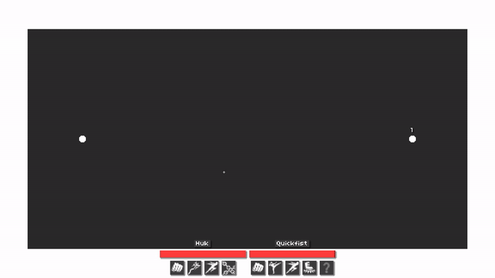
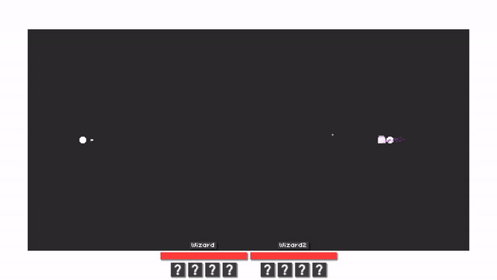
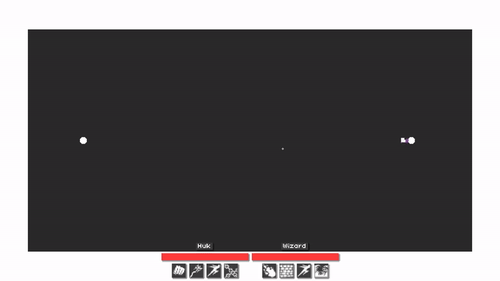
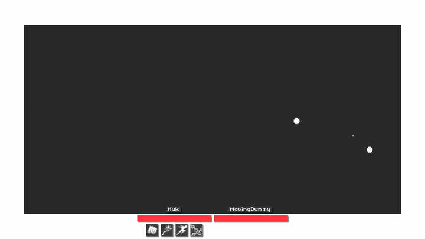
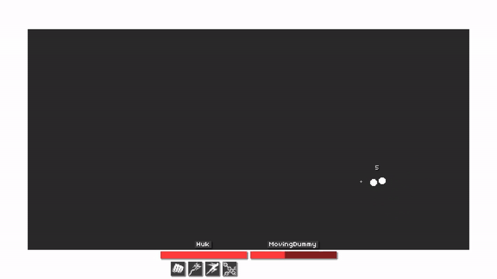

# Epoch

A 2D top-down action game built in **Godot 4.7** as a systems sandbox: the point is a set of clean, reusable gameplay systems — abilities, rules, combat, AI, physics and rope physics — demonstrated in an arena where AI-driven characters fight each other.

Everything is rendered with **geometry and particles only** into a pixel-perfect 576×324 viewport — the one exception is the ability icons, supplied from [game-icons.net](https://game-icons.net) (see [attribution](presentation/sprites/ability_icons/ATTRIBUTION.md)).

<p align="center">
  <a href="https://youtu.be/J_NTF4xO00E">
    
  </a>
</p>

## The systems

### Data-driven combat system
Interactions are driven by an event–condition–action pipeline (`rule/`), so new gameplay interactions plug in without touching character code:

- `RuleSystem` wraps every gameplay operation in a **BEFORE rules → operation → AFTER rules** pass, keyed by script + event id — call sites never branch on modifiers.
- Rules are plain resources: reusable, composable `RuleAction`s and `RuleCondition`s attached per character.
- Interactions flow through **typed context objects** (`DamageContext`, `HealingContext`, `PushContext`, `DeathContext`, `StatChangeContext`, …), which are the single mutation surface for rules.
- `AbilityTargeting` resolves intents flexibly — a target node, a direction, or a raw position — so one ability serves mouse-aiming players and AI alike.

### Ability system
Configuration is fully separated from runtime state (`abilities/core/`):

- `Ability` is a **resource** (pure configuration); `AbilityInstance` is the per-character **runtime state machine** holding cooldowns, step position, hold/charge state. Each character gets its own duplicate of the config, so stateful abilities never leak between users.
- **Slots and passives**: `PRIMARY`, `SECONDARY`, `UTILITY`, `SPECIAL` and four `EXTRA` slots, plus passive abilities.
- **Multi-step and charge activation**: `AbilityStep`s chain CLICK / HOLD / WAIT triggers with a step window, hold-to-charge timing (`hold_duration`) and deferred advances — one state machine drives everything from a simple punch to a charged arcane bolt.
- Ten abilities shipped on this framework: punch, kick, dash, stomp, rage, grapple, chain trap, arcane bolt, fire breath, earth wall.

### Behavioral combat AI
AI (`character/input/ai/`) is built as simulated perception and steering, not scripting:

- **Simulated perception**: a `DangerSensor` sweeps physics space and classifies incoming projectiles by **trajectory** — the cross-product distance between the projectile's velocity line and the character decides what counts as a threat.
- **Reaction delays**: sensing a new threat starts a per-AI reaction timer before the dodge begins.
- **Line-of-sight gating**: abilities only charge/release when a physics ray against the environment wall layer is clear; the cast aborts the moment sight is lost.
- **Circle-strafe kiting**: the wizard orbits its target inside a retreat/engage range band, closing in when the target strays and sidestepping when cover blocks the shot.
- **Stuck detection**: if the AI tries to move but grinds nearly to a standstill along an apparently valid nav path, the orbit direction flips.
- **Navmesh navigation**: all movement runs through `NavigationAgent2D` over a baked navigation polygon, with avoidance-aware velocity and `NavigationServer2D`-based wander/retreat points.
- Shared machinery (`AIInput`) is extended by distinct personalities: `WizardAI` (kiting caster) and `QuickfistAI` (no-kiting melee brawler with per-ability range checks).

| Quickfist senses the incoming hook, dodges it *without dropping the chase*, then closes in | Wizard walls the incoming bolt, then sidesteps into orbit and keeps charging while it circles |
|---|---|
|  |  |

### Collision layer management
Godot's numeric physics masks are abstracted into named profiles (`world/physics/`):

- A `PhysicsProfile` declares layer/mask pairs for characters, projectiles and hitboxes as plain data on character configs.
- `PhysicsLayerController` + `PhysicsMaskResolver` **allocate physics layers dynamically per team** at runtime and resolve them by name (`&"player"`, `&"enemy"`, `&"environment"` sublayers) — no system ever hardcodes layer bits, and new teams compose collision rules automatically.

### Custom Verlet rope simulation
A self-contained strand simulation (`strand/`) powers the grapple-hook mechanic:

- A constraint solver over verlet particles with **distance constraints** and **particle pinning**, behind a **swappable solver interface** (`StrandSolver` base resource, `VerletStrandSolver` implementation).
- **Formations** (straight, spiral, zigzag) sample rope rest shapes; `StrandBody` adapters couple rope segments with rigid bodies, particles, and immovable anchors.
- The simulation is fully decoupled from gameplay — the grapple ability opts in by attaching strand bodies to the hook and the victim.

| Hook blocked by a wall — the rope anchors to the static object and pulls the *attacker* in | Hook catches a target — equal masses pull each other together | Chain trap — six strands converge on and hold one body |
|---|---|---|
|  |  |  |

## Architecture at a glance

The `World` scene assembles all services and injects them explicitly through `WorldServices`; gameplay logic lives in small `RefCounted` components, and `Node`s are reserved for what needs the scene tree. Gameplay-to-presentation communication goes only through signals (`CombatEvents` bus), which drive floating damage text and UI widgets. The one autoload, `GameSession`, only carries the menu's character selection across the scene change into the match — gameplay itself sees none of it.

```
abilities/   core state machine + concrete abilities    rule/        event-condition-action pipeline
character/   components, configs, player & AI input     strand/      verlet solver, formations, bodies
combat/      hitboxes, projectiles, status effects      world/       services, teams, physics profiles
presentation floating text, UI widgets, VFX             menus/       main menu, game setup, game over
```

## Running it

1. Install [Godot 4.7](https://godotengine.org/download) (GL Compatibility renderer is enough — that's what the project targets).
2. Open the project folder in Godot, or run from the CLI:

   ```sh
   godot --path .
   ```

Smoke tests for abilities, AI and game flow live in `tests/`.

## License

[MIT](LICENSE)
